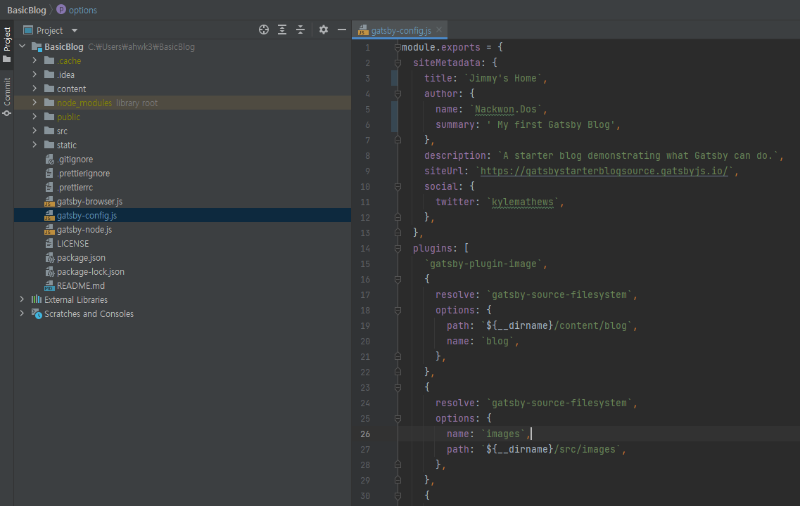
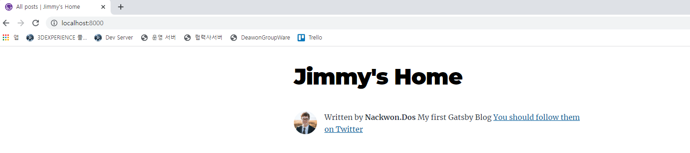
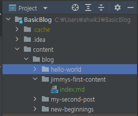
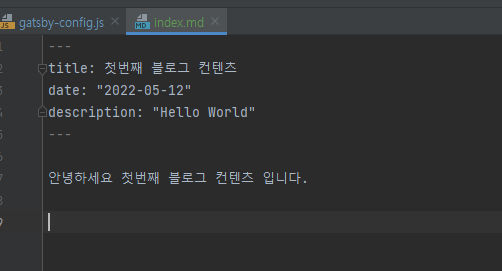
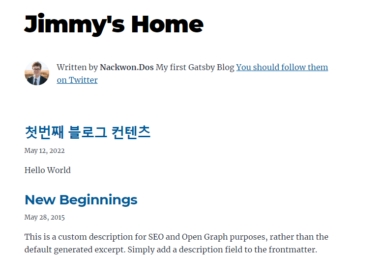
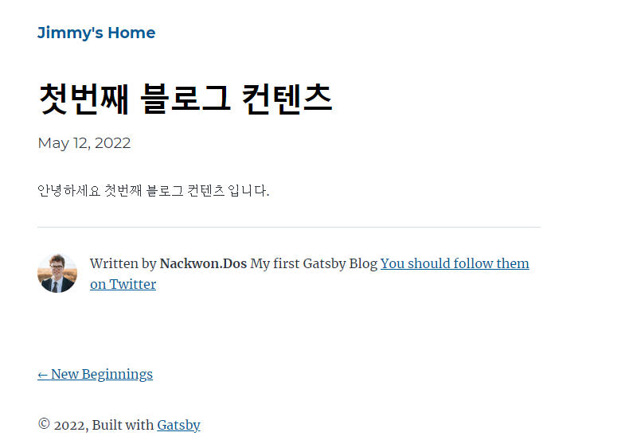

이전 포스팅에 이어서 진행하도록 하겠습니다.

## 블로그 컨텐츠 업로드

이제 한번 컨텐츠도 올려봐야하고 기본 정보도 바꿔보겠습니다.
  
    조금 쉽게 편집을 하려면 툴이 필요합니다.   
    개발자라면 누구나 개발 툴을 사용하기 때문에 사용하시던걸로 하면 될 것 같습니다.   
    저는 인텔리제이를 사용하고 있기 때문에 인텔리제이로 진행하겠습니다.   

각자 편리한 툴로 접속 후 해당 Project 를 열어줍니다.   

Project 에 'gatsby-config.js' 파일을 열어봅니다.   
왠지 siteMetadata 부분을 수정하면 변경이 될 것 같습니다.   
해당 부분에 title, author 에 name 과 summary 를 아래와 같이 변경합니다.

이제 다시 로컬 URL 로 들어가봅시다.   
그러면 이제 내가 입력한 값으로 변경된 것을 볼 수 있습니다.

    각 테마마다 설정하는 방식이 조금씩 다릅니다.   
    대부분 각 테마별로 ReadMe.md 에 설명이 있으니 그 방식에 따라 수정해주시면 됩니다. 

블로그 이름을 바꿨으니 컨텐츠를 올려보겠습니다.    
content 폴더로 이동 후 하위에 내가 올릴 컨텐츠를 위한 폴더를 하나 만듭니다.   
그 폴더에 *.md 파일을 하나 만들어 생성해줍니다.   

   
그 파일을 열어 아래와 같이 작성해 줍니다.

이제 그 결과 값을 한번 보겠습니다.
저희가 추가한 컨텐츠가 추가가 되었고 내용도 작성되는 것을 볼 수 있습니다.
 

컨텐츠 추가까지 완료가 되었습니다.  
테마 별로 사용 방법이 다를 수 있습니다. 다른 테마를 사용할 경우 ReadMe.md 를 읽고 사용하세요.

