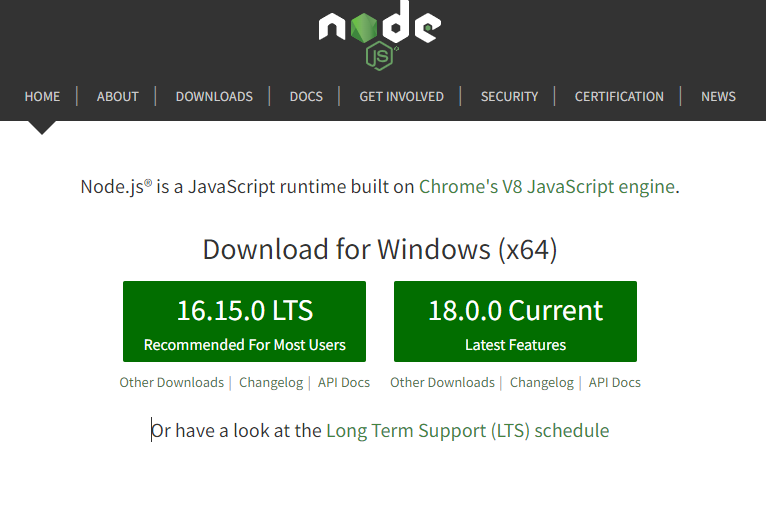
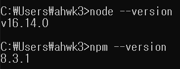
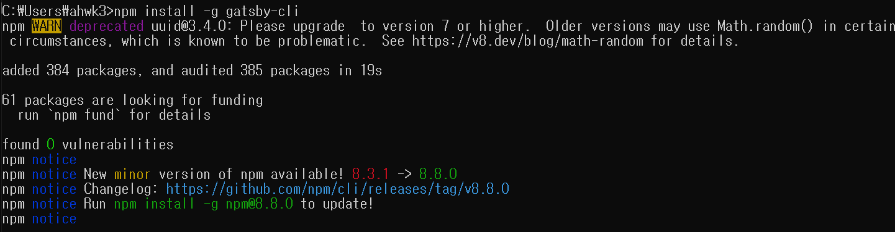
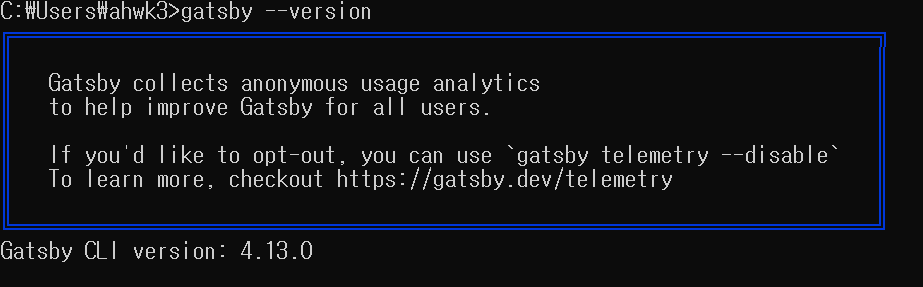
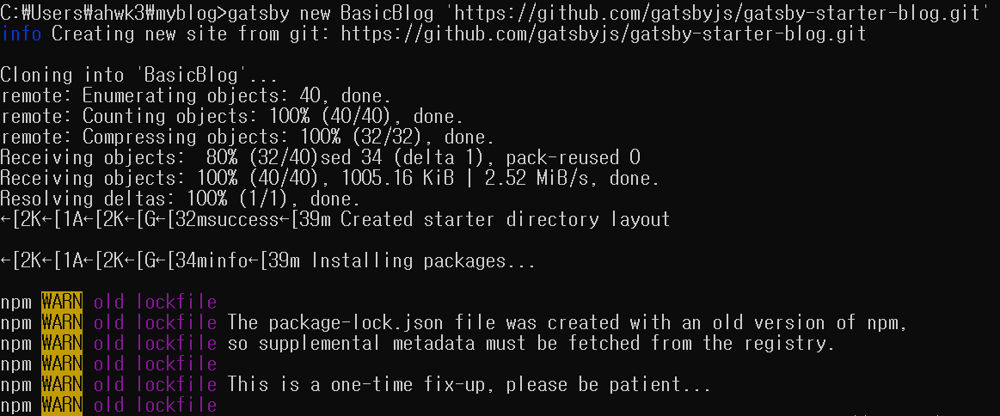
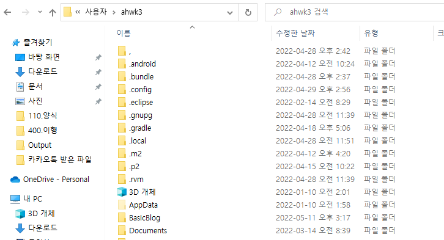
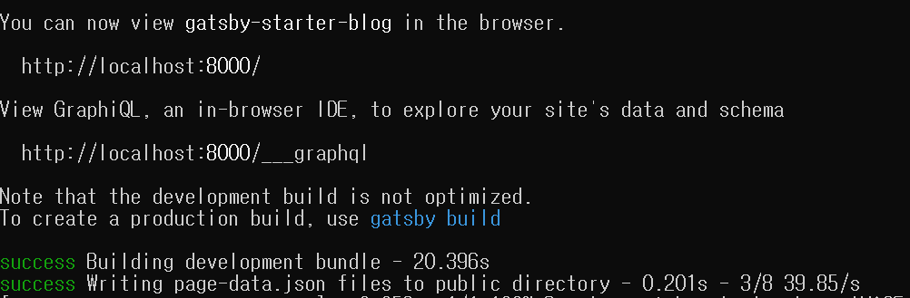
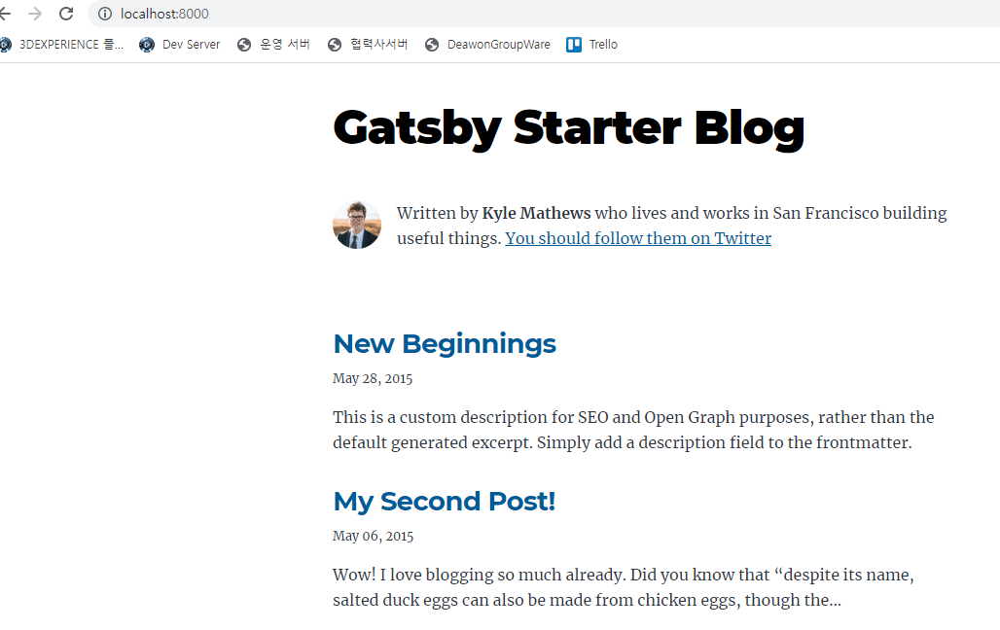
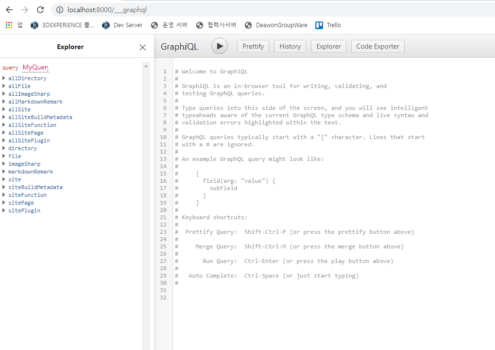

이제 Gatsby 를 설치 해봅시다.

그 전에 운영체제에 따라 설치 방법이 조금 다르니 그 점 유의 해야 합니다.
 
Mac OS 와 Window 운영체제 설명을 남기도록 하겠습니다.

## Node JS 설치

Node JS 를 사용해본 사용자는 이미 설치가 되어 있으니 Node 버전만 일단 확인하고 나머지는 설치를 해야 합니다.    

[Node JS 사이트](https://nodejs.org/en/)

Node JS LTS 를 다운 받아 설치를 완료 해줍니다.   
설치 과정은 그냥 전부 default 로 진행하면 되고 완료되면 제대로 설치가 되었는지 확인만 해줍니다.    

커맨드(Window 키 + R)를 열어 각 Version 을 확인하자.    
설치가 정상적으로 완료되었다면 문제없이 Version 을 확인할 수 있다. 
  

    node --version
     npm --version 
    

    
    NPM은 Node LTS 를 설치하면 같이 설치가 된다.
     NPM은 자바스크립트 프로그래밍 언어를 위한 패키지 관리자를 말하며,
     이걸로 간단하게 패키지들을 설치하거나 관리를 할 수 있다.
 
## Gatsby 설치

이제 Gatsby 설치 준비가 완료되었으니 Gatsby 를 설치 해주자.   
아까 커맨드 창에서 다시 아래의 명령어를 실행시키면 자동으로 설치를 진행합니다. 

    npm install -g gatsby-cli

완료가 되었다면 다시 확인을 해봅시다.  
아래와 같이 화면이 나오고 Version 이 제대로 출력이되면 되겠습니다.

    gatsby --version 

대부분의 설치나 복사 작업 등은 위와 같이 커맨드로 이루어 집니다.  
항상 켜놓고 있으면 될 것 같습니다.

## 로컬에 블로그 생성 및 테마 적용

URL 을 입력하게 되면 내가 만든 페이지로 접속이 되어야 합니다.   
네이버나 티스토리같은 블로그는 컨텐츠 입력 후 저장을 누르면 끝이지만   
Gatsby 는 소스 코드를 깃 허브에 업로드 후 배포를 시켜야 다른 사람들도 볼 수 있습니다.  

그래서 지금 할 것은 내 컴퓨터에서 컨텐츠를 작업 후 제대로 뜨는지 확인하는 작업이 필요 합니다.   

    gatsby new BasicBlog 'https://github.com/gatsbyjs/gatsby-starter-blog.git'
     BasicBlog -> Folder 이름 (임의로 설정 가능)
     https://github.com/gatsbyjs/gatsby-starter-blog.git -> 테마 소스코드가 존재하는 곳 (기본 베이직 테마 코드 이용)

위의 명령어는 아래와 같은 맥락으로 해석하면 될 것 같습니다. 

    'https://github.com/gatsbyjs/gatsby-starter-blog.git'에 업로드 되어 있는
     소스 코드를 복사해서 "BasicBlog" 폴더로 붙여 넣기 해라.
 
* 경로 확인은 필수 
  * 커맨드 창을 열면 기본 C:\Users\ahwk3(사용자 마다 다름)위치 이지만 다를 경우도 있으니 확인 필요합니다.
  * 해당 위치에 소스 코드가 복사되는 것이니 확인이 꼭 필요합니다.

   

이렇게 설치가 진행이 됩니다.   
이제 내가 지정한 폴더에 제대로 파일들이 들어와있는지 확인을 해봅시다.   
아마 해당 폴더 위치는 특별한 경우를 제외한 모두 같을 겁니다.   
C:\Users\ahwk3(사용자 마다 다름) 위치로 들어가면 BasicBlog 폴더가 생긴 것을 볼 수 있습니다.

 

## Gatsby 실행 및 로컬에서 블로그 확인

자! 이제 거의 끝이 났습니다.    
다시 커맨드를 열어 아래 명렁어를 입력합니다.

    cd BasicBlog
     gatsby develop

* 커맨드 명령어를 통해 우리가 복사해온 폴더로 이동 후 Gatsby 를 실행해야 합니다.
      
아래와 같이 깔끔하게 빌드가 완료되고 이제 로컬에서 URL 입력 후 접속이 가능합니다.
     

두개의 http 로 시작하는 URL 이 존재하는데 이것을 인터넷 창에 입력해보겠습니다.

 - http://localhost:8000/
 

 - http://localhost:8000/___graphql

 

이제 블로그 작성할 준비는 끝이 났습니다.   
소스코드를 올리고 배포하는 과정만 남았습니다.   
