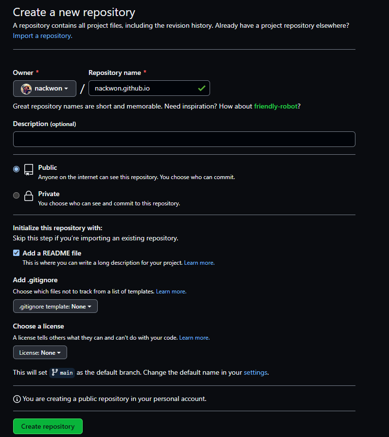

로컬에 테마 적용이 된 것을 확인을 했습니다.  

이제 남은 과정은 아래와 같습니다.
1. 깃 허브와 연결 
2. 블로그 배포

### 깃 허브 연결 및 소스 등록

일단 로컬에 있는 소스 코드들을 깃 허브에 올려야 합니다. 

깃 허브 왼쪽 상단에서 'New repository' 메뉴로 Repository 를 하나 생성합니다.

'Repository Name' 을 입력하고 생성시켜 줍니다.   

    이때 Repository Name 은 Owner 에 적힌 이름.gethub.io 로 하길 추천합니다.
    

생성이 완료되면 위와 같이 Repository 정보를 확인할 수 있습니다.   
내 소스코드를 저장할 수 있는 공간이 만들어졌으니 이제 Starter-Blog 를 추가해주겠습니다.   

Git Bash 를 열어 해당 폴더로 이동 후 현재 파일의 상태를 한번 살펴 봅니다.

    cd '폴더 이름'
    git status

    git add 
    git commit -m ""
    git remote add 'origin' ''
    git push origin master

* git add
  * 저장소에 올릴 파일 및 폴더를 준비 영역에 추가한다.
  * add '폴더 이름, 파일' 혹은 제외하면 변경된 사항 모두 추가한다.    
     

* git commit -m "메시지 입력"
  * 준비 영역에 추가된 것들을 모두 커밋하는 명령어 입니다.
  * 이때부터 버전 관리가 되고 -m "" 커밋 시 남길 메세지를 입력합니다.    
     

* git remote add 'origin' '원격 저장소 URL'
  * 'origin' 이란 이름으로 원격 저장소 주소를 등록합니다. 
  * origin 은 아무 이름으로 설정 가능합니다.
  * 원격 저장소 URL 은 Repository 생성 후 정보 중 Code 부분에 HTTPS 탭에 존재합니다.
   

* git push '원격 저장소 이름' '브랜치 이름' 
  * 최종 저장소에 넣어주는 명령어
  * 위에서 만든 원격 저장소 이름 'origin'
  * 현재 Branch 이름 (default : master)

    
위의 과정이 끝나고 다시 깃 페이지로 돌아오면 내 소스코드가 추가되어 있는 것을 볼 수 있습니다.

### 블로그 배포

그렇게 만든 블로그를 이제 다른 사람도 볼 수 있도록 배포하는 과정만 남았습니다.   
Setting -> Pages 로 들어갑니다.   

